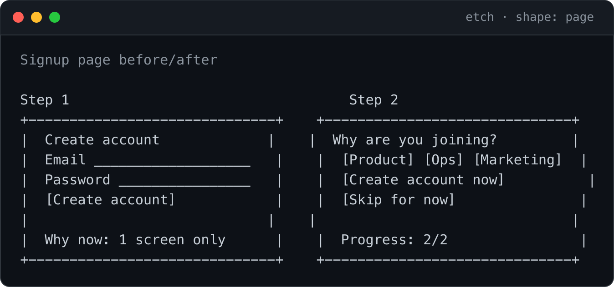
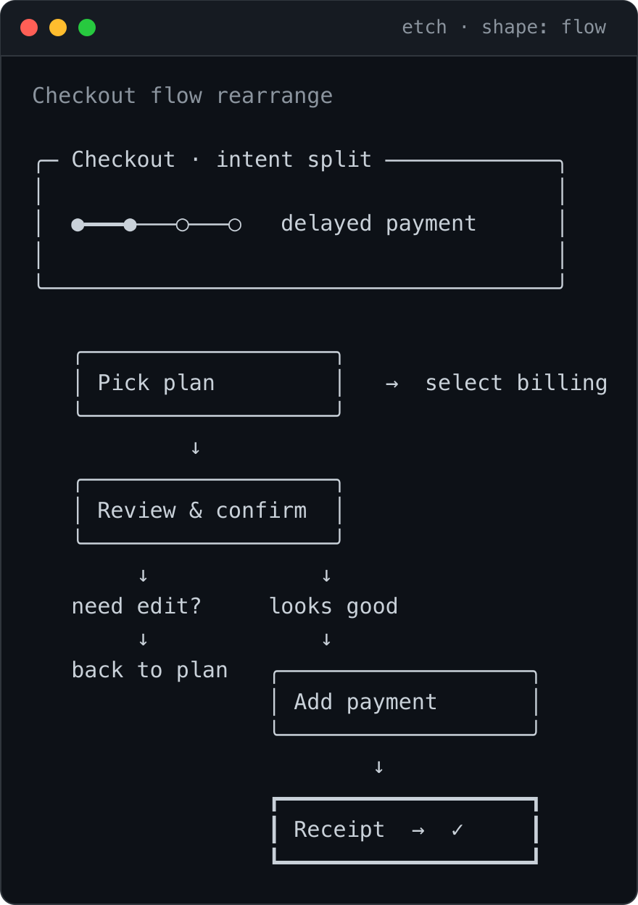
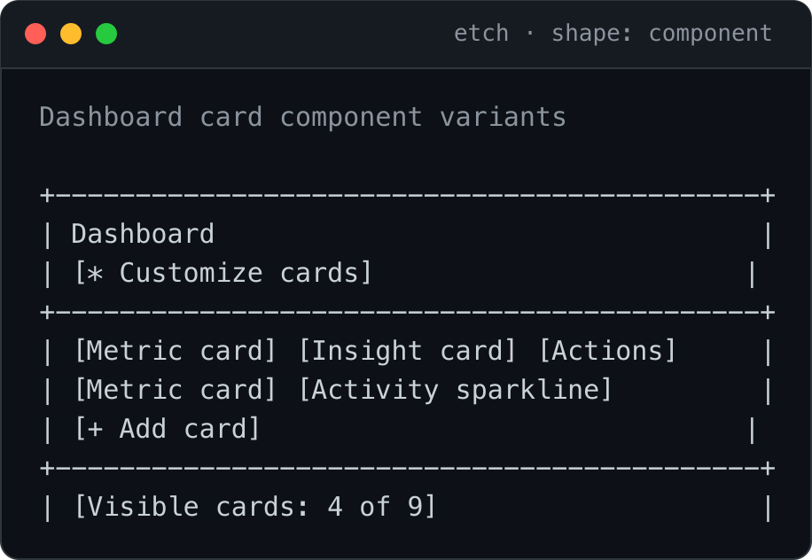

# ✏️ etch — Teach your agent to wireframe

> Turn a brief into ordered ASCII UI wireframe alternatives — one plain-text
> artifact, no design tool.

`etch` turns a product brief, finding, diff, or hypothesis into ordered UI
alternatives that agents and humans can read without a design tool.

It emits one copy-pasteable markdown artifact with ASCII page mocks, flow
diagrams, component variants, copy tables, or before/after diffs. The output is
ready for Claude Code, Cursor, Codex, Slack, email, pull requests, issue
threads, and any agent host that can pass text around.

etch's **output** is always plain text — no Figma, no screenshots in the
artifact, no external rendering service. (The gallery images below are just that
text, rendered on demand by a small script — `npm run gallery`.)

## Gallery

Every card below is real `etch` output: the designed monospace sketch from an
artifact in [`examples/`](examples/), dropped into a terminal frame by
[`tools/render-gallery.mjs`](tools/render-gallery.mjs). The artifact itself stays
plain text — the image is generated from it, not drawn by hand.

<p align="center">
  <br><br>
  
  
</p>

More shapes: [`diff`](assets/gallery/diff-shape.png) and
[`copy`](assets/gallery/copy-variants.png).

## Why agent-native wireframes

Agents often need to compare UI choices before implementation, but visual design
tools are awkward inside terminal and chat workflows. `etch` keeps the
design artifact in the same medium as the agent's plan: plain text.

That makes alternatives cheap to generate, easy to review, and safe to attach to
implementation work:

- cheap option first, larger redesign last;
- rationale tied to the source brief;
- change list with file-level notes when paths are known;
- effort estimate for each alternative;
- watch metric and threshold so the idea can be verified after shipping.

## Install

`etch` is a Claude Code skill, shipped as a single-plugin marketplace:

```text
/plugin marketplace add astaub/etch
/plugin install etch@etch
```

After install, invoke it as the slash command `/etch:etch`, or compose it from
another skill via `Skill(etch)`. Prefer a no-plugin setup? Clone the skill
straight into your skills directory and invoke it as `/etch`:

```text
git clone https://github.com/astaub/etch.git ~/.claude/skills/etch
```

See [DISTRIBUTION.md](DISTRIBUTION.md) for the full install/public-flip runbook.

## Use when

- A product finding needs multiple possible UI responses.
- A code diff or feature brief needs a quick before/after sketch.
- A team wants alternatives before committing implementation time.
- An agent needs a design artifact it can include directly in a plan, PR, or
  handoff.

## Inputs

`etch` accepts:

- finding ID or source reference resolved by a host adapter;
- feature brief text;
- code diff snippet;
- hypothesis text;
- raw product-intent sentence.

The core expects already-resolved text. Host adapters are responsible for
reading local files, issue trackers, analytics systems, or private findings.

## Shapes

| Shape | Use it for | Output style |
| --- | --- | --- |
| `page` | Page-level alternatives | Boxed sections with hierarchy |
| `flow` | Step, journey, branch, or checkout changes | Arrow paths and branch labels |
| `component` | Cards, buttons, inputs, widgets, nav | Variant grid and composition notes |
| `copy` | Headlines, body copy, CTAs, empty or error states | Markdown tables |
| `diff` | Before/after UI or code-adjacent layout change | Side-by-side text diff |

## Invocation

`etch` is a skill, not a published package — there is no binary to install. It
takes a brief plus optional arguments:

```text
Skill(etch) --shape flow --count 3
echo "Remove friction before creating an account" | Skill(etch) --shape page
```

Defaults:

- `shape`: auto-detected from the brief unless `--shape` is set;
- `count`: `3`;
- `output`: one markdown block;
- local reads and writes: none in the core.

## Output contract

Each alternative includes:

- title;
- rationale tied to evidence in the brief;
- change list, with file-level notes when filenames are known;
- effort: `XS`, `S`, `M`, or `L`;
- "How we'll know it worked" metric and threshold;
- one designed monospace sketch (or table) — aligned, airy, obviously a mockup.

The sketches use a small, deliberate design language (see `SKILL.md` §
"Design system"): rounded box-drawing on a Menlo-safe glyph allowlist, "Tailwind
for the CLI" spacing/sizing tokens, a reusable component library, and one law —
every row padded to one identical width so frames never go ragged. Every sketch
reads in both a light (cream paper) and dark (terminal) skin with no layout
change. It is still just text — no Figma, no screenshots, universally
monospace-safe in terminals, Slack, and GitHub.

The alternatives are ordered from least invasive to most invasive so an agent can
choose a safe first move or escalate deliberately.

## Examples

The staged examples cover the five shipped shapes:

- [`page-before-after.md`](examples/page-before-after.md) — signup page
  alternatives.
- [`flow-rearrange.md`](examples/flow-rearrange.md) — checkout flow
  rearrangement.
- [`component-variants.md`](examples/component-variants.md) — dashboard card
  variants.
- [`copy-variants.md`](examples/copy-variants.md) — pricing copy alternatives.
- [`diff-shape.md`](examples/diff-shape.md) — settings deletion before/after
  diff.

## Agent host integration

`etch` is designed as a host-agnostic primitive.

Claude Code, Cursor, Codex, or another agent host should:

1. Resolve the source brief, finding, or diff.
2. Pass scrubbed text into the core.
3. Let the core generate alternatives in markdown.
4. Attach the artifact to the plan, PR, issue, or handoff.
5. Keep source-specific reads, credentials, private URLs, and artifact writes in
   the host adapter.

The core owns generation rules and output shape. Hosts own context resolution and
routing.

## Safety

- Local reads: none by default.
- Local writes: none by default.
- Network: none.
- Credentials: none.
- Private data: source resolution belongs in host adapters, not the core.
- Examples: synthetic and customer-agnostic only.

## Why "etch"

To etch is to cut a clean line into a surface. `etch` does that for UI ideas —
it scratches the shape of a screen into plain text your agent can read, share,
and act on.

## Contributing

Governance lives in [AGENTS.md](AGENTS.md) (the agent-agnostic contract: propose
via PR, no self-merge, never push `main`) and [CONTRIBUTING.md](CONTRIBUTING.md)
(project shape + output contract). The skill itself has no build step; tests run
under [vitest](https://vitest.dev):

```bash
npm install
npm test
```

## License

MIT

